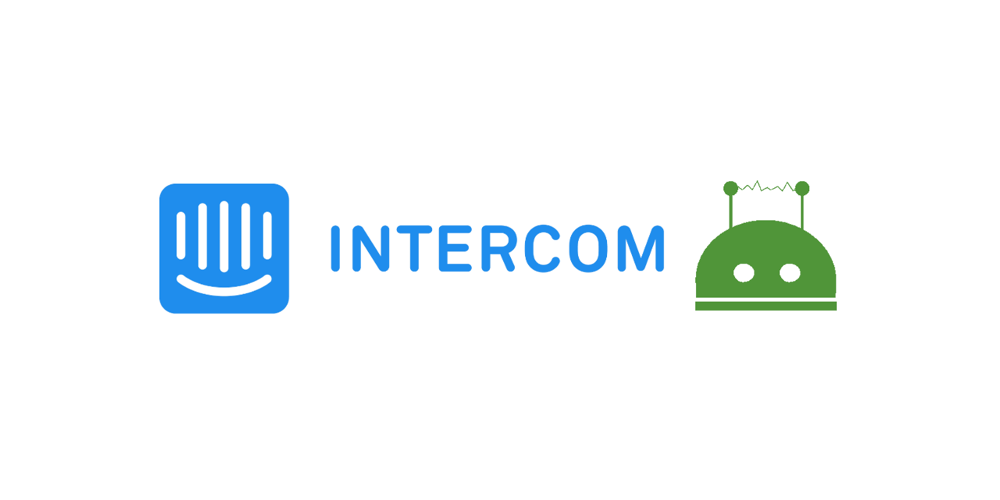
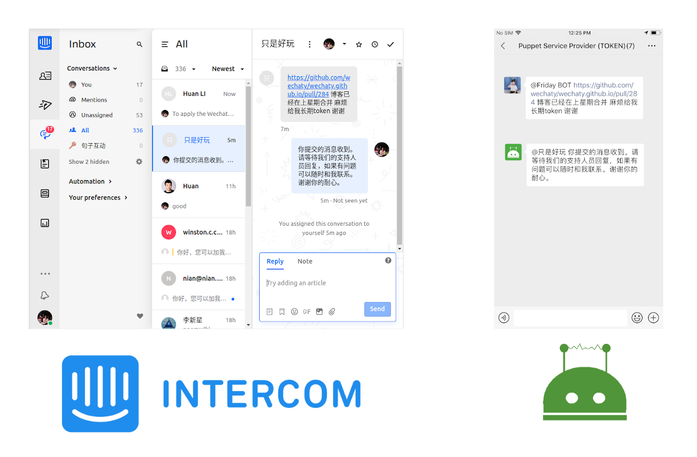

# wechaty-plugin-intercom [](https://github.com/wechaty/wechaty-plugin-intercom)

 [](https://www.npmjs.com/package/wechaty-plugin-intercom)
 [](https://github.com/wechaty/wechaty-plugin-intercom/actions?query=workflow%3ANPM)

Managing Conversations in WeChat Rooms by Intercom.



[](https://github.com/Wechaty/wechaty)
[](https://www.typescriptlang.org/)

## Introduction

Wechaty Intercom Plugin helps you to manage your customers/leads/users in the WeChat Room, with the power of the Intercom service.

## Usage

```ts
import { WechatyIntercom } from 'wechaty-plugin-intercom'

const config = {
  room: 'room_id@chatroom',

  at: true,
  webhookProxyUrl : 'https://smee.io/your_smee_io_proxy_url',
  intercomToken   : 'your_intercom_authorization_token',
}

const IntercomPlugin = WechatyIntercom(config)

const wechaty = new Wechaty()
wechaty.use(IntercomPlugin)
```

1. `config.room`: The room id of your service WeChat room.
1. `config.at`: If set to `true`, customers need to use `@` to mention the bot when they want to ask questions.
1. `config.webhookProxyUrl`: A `semee.io` link that you need to set it to receive the Intercom Webhook events.
    1. [Intercom Developer Hub - Webhook Topics](https://developers.intercom.com/building-apps/docs/webhook-model#section-webhook-topics)
    1. [smee.io - Webhook payload delivery service](https://smee.io/) - Receives payloads then sends them to your locally running application.
1. `config.intercomToken`: The Authorization Token for your Intercom account.
    1. [Intercom Developer Hub - How to get your Access Token](https://developers.intercom.com/building-apps/docs/authentication-types#section-how-to-get-your-access-token)

### Environment Variables

The following two environment variables will be used if the required information is not provided by the config.

#### 1 `WECHATY_PLUGIN_INTERCOM_TOKEN`

`process.env.WECHATY_PLUGIN_INTERCOM_TOKEN` will be used if the `config.intercomToken` is not provided.

Learn more about the authorization token of intercom: [Intercom Developers - How to get your Access Token](https://developers.intercom.com/building-apps/docs/authentication-types#section-how-to-get-your-access-token)

#### 2 `WECHATY_PLUGIN_INTERCOM_WEBHOOK_PROXY_URL`

We receive webhook payloads with the help from <smee.io>, by proxy them to our locally running Wechaty Plugin application.

`process.env.WECHATY_PLUGIN_INTERCOM_WEBHOOK_PROXY_URL` will be used if the `config.webhookProxyUrl` is not provided.

See:

1. [Intercom Developer Hub - Webhook Topics](https://developers.intercom.com/building-apps/docs/webhook-model#section-webhook-topics)
1. [smee.io - Webhook payload delivery service](https://smee.io/) - Receives payloads then sends them to your locally running application.

## Screenshot



## History

### master

### v0.2 (Jun 2020)

1. Init code base
1. Room message to Intercom
1. Intercom message to Room (Powered by Smee.io)

## Contributors

[](https://sourcerer.io/fame/huan/wechaty/wechaty-plugin-intercom/links/0)
[](https://sourcerer.io/fame/huan/wechaty/wechaty-plugin-intercom/links/1)
[](https://sourcerer.io/fame/huan/wechaty/wechaty-plugin-intercom/links/2)
[](https://sourcerer.io/fame/huan/wechaty/wechaty-plugin-intercom/links/3)
[](https://sourcerer.io/fame/huan/wechaty/wechaty-plugin-intercom/links/4)
[](https://sourcerer.io/fame/huan/wechaty/wechaty-plugin-intercom/links/5)
[](https://sourcerer.io/fame/huan/wechaty/wechaty-plugin-intercom/links/6)
[](https://sourcerer.io/fame/huan/wechaty/wechaty-plugin-intercom/links/7)

## Author

[Huan LI](https://github.com/huan) ([李卓桓](http://linkedin.com/in/zixia)),
Tencent TVP of Chatbot, \<zixia@zixia.net\>

[](https://stackexchange.com/users/265499)

## Copyright & License

* Code & Docs © 2020 Huan LI \<zixia@zixia.net\>
* Code released under the Apache-2.0 License
* Docs released under Creative Commons
